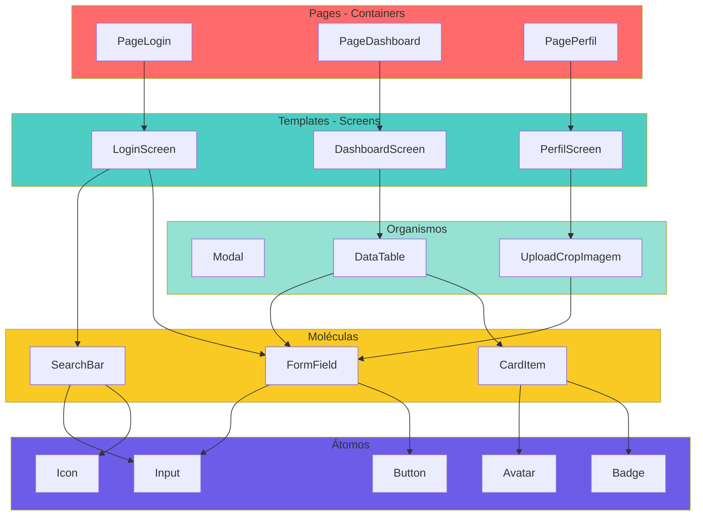
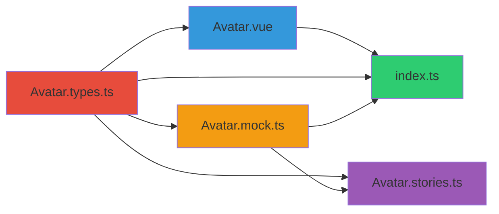
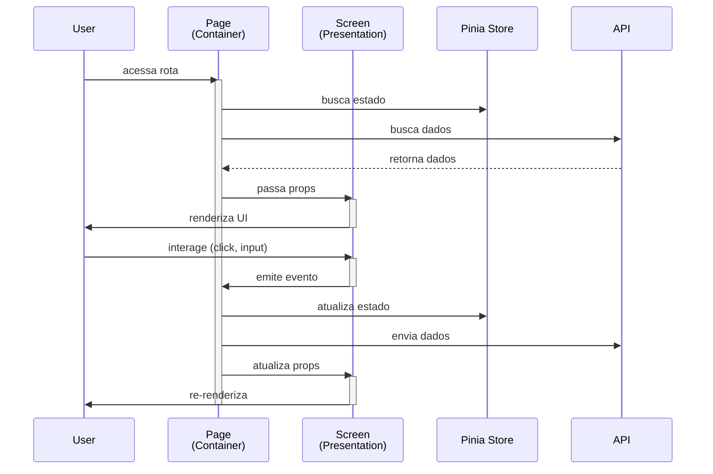
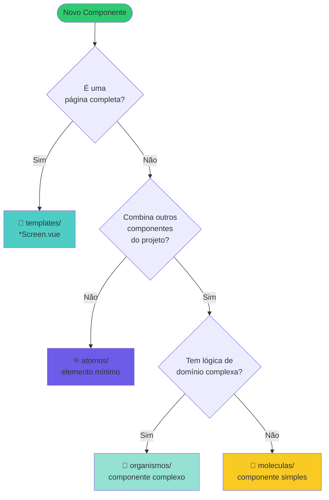
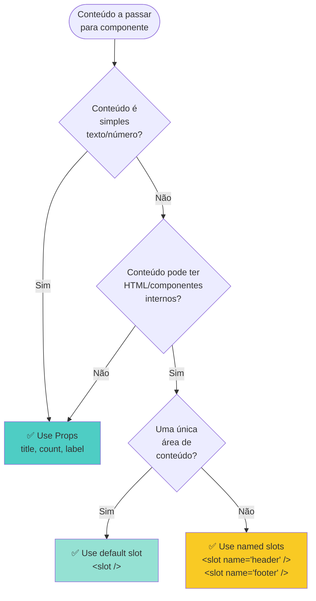
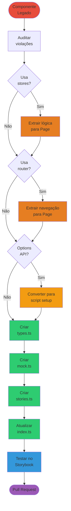

# Guia Visual — storytype

Este documento fornece visualizações e diagramas para facilitar o entendimento do padrão **storytype**.

---

## 📐 Arquitetura Geral

```
┌─────────────────────────────────────────────────────┐
│                    Application                      │
├─────────────────────────────────────────────────────┤
│                                                     │
│  ┌──────────────┐         ┌──────────────┐         │
│  │   Layouts    │         │    Pages     │         │
│  │  (estrutura) │────────▶│ (containers) │         │
│  └──────────────┘         └──────┬───────┘         │
│                                  │                  │
│                                  │ renderiza        │
│                                  ▼                  │
│                    ┌──────────────────────┐         │
│                    │      Templates       │         │
│                    │      (Screens)       │         │
│                    └──────────┬───────────┘         │
│                               │                     │
│                               │ compõe              │
│                ┌──────────────┴──────────────┐      │
│                │                             │      │
│                ▼                             ▼      │
│        ┌──────────────┐            ┌──────────────┐ │
│        │  Organismos  │            │  Organismos  │ │
│        └──────┬───────┘            └──────┬───────┘ │
│               │                           │         │
│               │ compõe                    │ compõe  │
│               ▼                           ▼         │
│        ┌──────────────┐            ┌──────────────┐ │
│        │  Moléculas   │            │  Moléculas   │ │
│        └──────┬───────┘            └──────┬───────┘ │
│               │                           │         │
│               │ compõe                    │ compõe  │
│               ▼                           ▼         │
│        ┌──────────────┐            ┌──────────────┐ │
│        │    Átomos    │            │    Átomos    │ │
│        └──────────────┘            └──────────────┘ │
│                                                     │
└─────────────────────────────────────────────────────┘

Legenda:
  ──▶  Usa/Renderiza
  │    Hierarquia de composição
```

---

## 🧬 Atomic Design — Hierarquia de Componentes



---

## 🔄 Padrão Container/Presentation

```
┌───────────────────────────────────────────────────────────┐
│                     Page (Container)                       │
│  ┌─────────────────────────────────────────────────────┐  │
│  │  ✅ Acessa Stores (Pinia)                           │  │
│  │  ✅ Acessa Router (vue-router)                      │  │
│  │  ✅ Faz chamadas de API                             │  │
│  │  ✅ Gerencia estado de negócio                      │  │
│  │  ✅ Lógica de validação de negócio                  │  │
│  └─────────────────────────────────────────────────────┘  │
│                           │                                │
│                           │ props                          │
│                           ▼                                │
│  ┌─────────────────────────────────────────────────────┐  │
│  │              Screen (Presentation)                   │  │
│  │  ┌───────────────────────────────────────────────┐  │  │
│  │  │  ❌ SEM Stores                                │  │  │
│  │  │  ❌ SEM Router                                │  │  │
│  │  │  ❌ SEM chamadas de API                       │  │  │
│  │  │  ✅ Apenas props, emits, v-model              │  │  │
│  │  │  ✅ Apresentação e UI                         │  │  │
│  │  │  ✅ Validação de UI                           │  │  │
│  │  └───────────────────────────────────────────────┘  │  │
│  └─────────────────────────────────────────────────────┘  │
│                           │                                │
│                           │ emits                          │
│                           ▼                                │
│                    (eventos de UI)                         │
└───────────────────────────────────────────────────────────┘
```

---

## 📁 Estrutura de Arquivos de um Componente

```
src/components/atomos/Avatar/
│
├── Avatar.vue              ┐
├── Avatar.types.ts         │
├── Avatar.mock.ts          ├─ Arquivos obrigatórios
├── Avatar.stories.ts       │
└── index.ts                ┘

Opcionais:
├── Avatar.spec.ts          (testes unitários)
└── Avatar.scss             (estilos externos)
```

### Fluxo de Dependências



---

## 🔄 Fluxo de Dados — Container/Presentation



---

## 🎨 Decisão de Camada — Fluxograma



---

## 📊 Lifecycle de Desenvolvimento de Componente

```mermaid
flowchart LR
    subgraph Planejamento
        A1[Definir<br/>requisitos] --> A2[Escolher<br/>camada]
    end

    subgraph Implementacao[Implementação]
        B1[Criar<br/>types.ts] --> B2[Criar<br/>vue]
        B2 --> B3[Criar<br/>mock.ts]
        B3 --> B4[Criar<br/>stories.ts]
        B4 --> B5[Criar<br/>index.ts]
    end

    subgraph Validacao[Validação]
        C1[Testar no<br/>Storybook] --> C2[Verificar<br/>checklist]
        C2 --> C3[Lint +<br/>Type check]
    end

    subgraph Review
        D1[Code<br/>Review] --> D2[Ajustes] --> D3[Merge]
    end

    A2 --> B1
    B5 --> C1
    C3 --> D1

    style Planejamento fill:#e8f5e9
    style Implementacao fill:#fff3e0
    style Validacao fill:#e3f2fd
    style Review fill:#f3e5f5
```



---

## 🔍 Decisão de Props vs Slots



---

## 🎯 Fluxo de Comunicação entre Componentes

```
┌─────────────────────────────────────────────────────┐
│                   Parent Component                   │
│                                                     │
│  const value = ref('initial')                       │
│                                                     │
│  ┌───────────────────────────────────────────────┐ │
│  │  <ChildComponent                              │ │
│  │    :prop-value="value"                        │ │◀── Props (down)
│  │    @update="handleUpdate"                     │ │
│  │  />                                           │ │
│  └───────────────────────────────────────────────┘ │
│           │                       ▲                 │
│           │ props                 │ emits           │
│           ▼                       │                 │
│  ┌───────────────────────────────────────────────┐ │
│  │          Child Component                      │ │
│  │                                               │ │
│  │  defineProps<{ propValue: string }>()        │ │
│  │  const emit = defineEmits<{                  │ │
│  │    (e: 'update', val: string): void          │ │──▶ Emits (up)
│  │  }>()                                        │ │
│  │                                               │ │
│  │  emit('update', 'new value')                 │ │
│  └───────────────────────────────────────────────┘ │
└─────────────────────────────────────────────────────┘

Alternativa: v-model (syntactic sugar)
─────────────────────────────────────
Parent: <ChildComponent v-model="value" />

Equivale a:
<ChildComponent
  :model-value="value"
  @update:model-value="value = $event"
/>

Child:
defineProps<{ modelValue: string }>()
emit('update:modelValue', newValue)
```

---

## 🏗️ Organização de Pastas do Projeto

```
src/
│
├── components/                    # Componentes reutilizáveis
│   ├── atomos/                   # ⚛️  Elementos mínimos
│   │   ├── Avatar/
│   │   ├── Button/
│   │   └── Icon/
│   │
│   ├── moleculas/                # 🧬 Componentes simples
│   │   ├── FormField/
│   │   ├── SearchBar/
│   │   └── CardItem/
│   │
│   ├── organismos/               # 🏢 Componentes complexos
│   │   ├── Modal/
│   │   ├── DataTable/
│   │   └── UploadCropImagem/
│   │
│   └── templates/                # 📄 Screens (apresentação)
│       ├── LoginScreen/
│       ├── DashboardScreen/
│       └── PerfilScreen/
│
├── pages/                        # 📑 Pages (containers)
│   ├── auth/
│   │   ├── PageLogin.vue
│   │   └── PageCadastro.vue
│   └── dashboard/
│       └── PageDashboard.vue
│
├── layouts/                      # 🎨 Layouts
│   ├── MainLayout.vue
│   └── AuthLayout.vue
│
├── store/                        # 🗄️  Estado global (Pinia)
│   ├── auth.ts
│   └── user.ts
│
├── api/                         # 🌐 Clientes de API
│   ├── auth-api.ts
│   └── user-api.ts
│
├── composables/                 # 🔧 Lógica reutilizável
│   ├── useAuth.ts
│   └── useApi.ts
│
├── services/                    # 🛠️  Serviços
│   └── storage.ts
│
├── utils/                       # 🧰 Utilitários
│   ├── formatters.ts
│   └── validators.ts
│
└── router/                      # 🗺️  Rotas
    └── index.ts
```

---

## 📝 BEM (Block Element Modifier) — Estrutura CSS

```scss
// Block (componente raiz)
.card-atividade {
}

// Elements (partes do componente)
.card-atividade__titulo {
}
.card-atividade__descricao {
}
.card-atividade__imagem {
}
.card-atividade__footer {
}

// Modifiers (variações)
.card-atividade--destacado {
}
.card-atividade--compacto {
}
.card-atividade--disabled {
}

// Element + Modifier
.card-atividade__titulo--grande {
}
.card-atividade__botao--primario {
}

// Estados (prefixo is/has)
.card-atividade.is-loading {
}
.card-atividade.is-selected {
}
.card-atividade.has-error {
}
```

### Exemplo Visual

```
┌────────────────────────────────────────┐
│  .card-atividade                       │  ← Block
│  ┌──────────────────────────────────┐  │
│  │  .card-atividade__titulo         │  │  ← Element
│  └──────────────────────────────────┘  │
│  ┌──────────────────────────────────┐  │
│  │  .card-atividade__descricao      │  │  ← Element
│  └──────────────────────────────────┘  │
│  ┌──────────────────────────────────┐  │
│  │  .card-atividade__footer         │  │  ← Element
│  │    ┌──────────────────────────┐  │  │
│  │    │  [Botão Primário]        │  │  │
│  │    └──────────────────────────┘  │  │
│  └──────────────────────────────────┘  │
└────────────────────────────────────────┘

.card-atividade--destacado  ← Modifier (fundo colorido)
.card-atividade.is-loading  ← Estado (mostra spinner)
```

---

## 🎭 Storybook — Hierarquia de Stories

```
Storybook UI
│
├── 📘 Introdução
│   └── Getting Started
│
├── ⚛️  Atomos
│   ├── Avatar
│   │   ├── Default
│   │   ├── Large
│   │   ├── Small
│   │   └── Variantes
│   │
│   ├── Button
│   └── Icon
│
├── 🧬 Moleculas
│   ├── FormField
│   ├── SearchBar
│   └── CardItem
│
├── 🏢 Organismos
│   ├── Modal
│   ├── DataTable
│   └── UploadCropImagem
│
└── 📄 Templates
    ├── LoginScreen
    │   ├── Default
    │   ├── ComErro
    │   ├── Loading
    │   └── Mobile
    │
    ├── DashboardScreen
    └── PerfilScreen
```

---

## ♻️ Refatoração de Componente Legado



---

## 🔐 Regras de Isolamento de Componentes

```
┌──────────────────────────────────────────────────────┐
│           Camada de Apresentação (Pure)              │
│  ┌────────────────────────────────────────────────┐  │
│  │                                                │  │
│  │        atomos, moleculas, organismos           │  │
│  │                  templates                     │  │
│  │                                                │  │
│  │  ✅ Props, Emits, v-model, Slots              │  │
│  │  ✅ Computed, Watch, Refs                     │  │
│  │  ✅ Composables (UI logic)                    │  │
│  │                                                │  │
│  │  ❌ Pinia Stores                              │  │
│  │  ❌ vue-router (useRouter, useRoute)          │  │
│  │  ❌ API calls                                 │  │
│  │  ❌ localStorage/sessionStorage               │  │
│  │                                                │  │
│  └────────────────────────────────────────────────┘  │
└──────────────────────────────────────────────────────┘
                         ▲
                         │ props
                         │
                         │ emits
                         ▼
┌──────────────────────────────────────────────────────┐
│          Camada de Containers (Smart)                │
│  ┌────────────────────────────────────────────────┐  │
│  │                    Pages                       │  │
│  │                                                │  │
│  │  ✅ Pinia Stores                              │  │
│  │  ✅ vue-router                                │  │
│  │  ✅ API calls                                 │  │
│  │  ✅ localStorage/sessionStorage               │  │
│  │  ✅ Lógica de negócio                         │  │
│  │  ✅ Renderiza 1 Screen component              │  │
│  │                                                │  │
│  └────────────────────────────────────────────────┘  │
└──────────────────────────────────────────────────────┘
```

---

## 🎨 Padrão de Cores e Variáveis

```scss
// ✅ CORRETO — Usar variáveis CSS do Quasar
.componente {
  color: var(--q-color-primary);
  background: var(--q-color-grey-1);
  border-color: var(--q-color-grey-5);
}

// ❌ ERRADO — Cores hardcoded
.componente {
  color: #1976d2;
  background: #f5f5f5;
  border-color: #bdbdbd;
}

// Variáveis disponíveis
--q-color-primary      // Cor primária do tema
--q-color-secondary    // Cor secundária
--q-color-accent       // Cor de destaque
--q-color-positive     // Verde (sucesso)
--q-color-negative     // Vermelho (erro)
--q-color-warning      // Amarelo (aviso)
--q-color-info         // Azul (informação)
--q-color-dark         // Escuro
--q-color-grey-[1-14]  // Escala de cinzas
```

---

## 🧪 Estratégia de Testes

```
┌─────────────────────────────────────────────────────┐
│                  Componente Puro                     │
│  ┌───────────────────────────────────────────────┐  │
│  │                                               │  │
│  │  Testes via Storybook (visual)               │  │
│  │  ├─ Default state                            │  │
│  │  ├─ Loading state                            │  │
│  │  ├─ Error state                              │  │
│  │  ├─ Empty state                              │  │
│  │  └─ Edge cases                               │  │
│  │                                               │  │
│  │  Testes unitários Vitest (lógica complexa)   │  │
│  │  ├─ Computed properties                      │  │
│  │  ├─ Methods                                  │  │
│  │  └─ Watchers                                 │  │
│  │                                               │  │
│  └───────────────────────────────────────────────┘  │
└─────────────────────────────────────────────────────┘

┌─────────────────────────────────────────────────────┐
│                 Page (Container)                     │
│  ┌───────────────────────────────────────────────┐  │
│  │                                               │  │
│  │  Testes de integração Vitest                 │  │
│  │  ├─ Store interactions                       │  │
│  │  ├─ API calls (mocked)                       │  │
│  │  ├─ Router navigation                        │  │
│  │  └─ Business logic                           │  │
│  │                                               │  │
│  │  Testes E2E Playwright/Cypress               │  │
│  │  └─ Fluxos completos                         │  │
│  │                                               │  │
│  └───────────────────────────────────────────────┘  │
└─────────────────────────────────────────────────────┘
```

---

## 📊 Métricas de Qualidade

```
Checklist de Qualidade do Componente
═════════════════════════════════════

Estrutura                              Status
─────────────────────────────────────────────
✅ Pasta em PascalCase                  [✓]
✅ Camada Atomic Design correta         [✓]
✅ Arquivos obrigatórios criados        [✓]
✅ Barrel export (index.ts)             [✓]

TypeScript                             Status
─────────────────────────────────────────────
✅ Interface Props definida             [✓]
✅ Interface Emits definida             [✓]
✅ Props com readonly                   [✓]
✅ Zero erros TypeScript                [✓]
✅ Zero usos de 'any'                   [✓]
✅ Zero '@ts-ignore'                    [✓]

Vue                                    Status
─────────────────────────────────────────────
✅ Usa <script setup>                   [✓]
✅ defineProps com tipos                [✓]
✅ defineEmits com tipos                [✓]
✅ Styles scoped + SCSS + BEM           [✓]
✅ Sem stores/router/API                [✓]

Documentação                           Status
─────────────────────────────────────────────
✅ Mocks criados (3+)                   [✓]
✅ Stories criadas                      [✓]
✅ Story Default                        [✓]
✅ Story Variantes                      [✓]
✅ Story Mobile                         [✓]
✅ ArgTypes documentados                [✓]
✅ JSDoc completo                       [✓]

Qualidade                              Status
─────────────────────────────────────────────
✅ Funciona no Storybook                [✓]
✅ Zero erros ESLint                    [✓]
✅ Acessibilidade (ARIA)                [✓]
✅ Responsividade                       [✓]

Score: 27/27 = 100% ✅
```

---

**Guia Visual storytype v1.0**
Criado por: Sidarta Veloso
Última atualização: 9 de março de 2026
