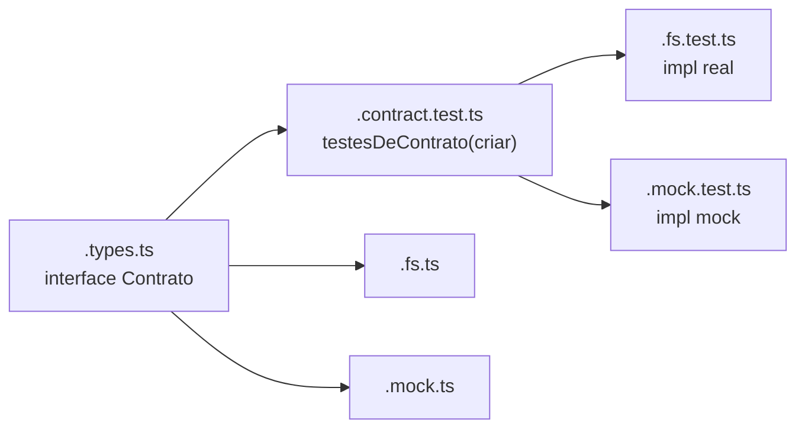

# Registro de Padrão Técnico — Estrutura de módulos (classe/serviço)

Tipo semântico:

`registro_padrao_tecnico`

## Propósito

Padronizar a organização de arquivos por classe ou serviço no código da
OpenTask, de modo que implementação, tipos, testes e mocks tenham lugar
previsível — e que múltiplas implementações de um mesmo contrato compartilhem
os testes. Precedente: o próprio taskin já usa isto (`hook-runner.ts` /
`.mock.ts` / `.test.ts`).

## A estrutura, por classe ou serviço

Cada classe ou serviço mora em uma **pasta com o seu nome** (kebab-case):

```
nome-da-classe-ou-servico/
  nome-da-classe-ou-servico.ts          # implementação
  nome-da-classe-ou-servico.types.ts    # tipos (interfaces, discriminated unions)
  nome-da-classe-ou-servico.test.ts     # testes da unidade
  nome-da-classe-ou-servico.mock.ts     # mock/fake, para uso pelos testes de OUTROS módulos
  index.ts                              # barrel: reexporta só a API pública
```

Nem todo arquivo é obrigatório: um serviço puro sem dependências pode dispensar
`.mock.ts`; um módulo só-de-tipos tem apenas `.types.ts` + `index.ts`.

## Exceção: componentes de UI

Componente de UI **não** segue a regra de nomes acima. Ele tem padrão próprio,
definido na [Especificação storytype](../packages/core/storytype-spec.md):
**pasta em kebab-case, arquivos em PascalCase**.

```
progress-bar/
  ProgressBar.vue              # componente
  ProgressBar.types.ts         # tipos
  ProgressBar.spec.ts          # testes da unidade
  ProgressBar.stories.ts       # stories Storybook
  ProgressBar.mock.ts          # mock, que alimenta as stories e os testes
  index.ts                     # barrel
```

Este conjunto é definido em um só lugar no código —
`COMPONENT_FILE_SET`, em `packages/cli/src/component-detector.ts` — e é de lá
que o `storytype generate` e o `storytype normalize` leem. `generate` escreve o
conjunto inteiro; `normalize` completa barrel, tipos e teste num componente que
já existe, e deixa story e mock para uma pessoa escrever, porque precisam das
props reais para valerem algo. Ver §5.1 da
[Especificação storytype](../packages/core/storytype-spec.md).

A pasta continua kebab-case, como em qualquer módulo — o que muda é o nome dos
arquivos, que acompanha o nome do componente em PascalCase. Isso existe porque o
nome do arquivo é o nome importado (`import ProgressBar from './ProgressBar.vue'`)
e porque é a convenção do ecossistema Vue e das ferramentas em torno dele
(Storybook, devtools, resolvedores de componente).

`storytype normalize` aplica exatamente esta forma; `storytype analyze` pontua
por ela. Um componente solto num nível Atomic Design (`atoms/ProgressBar.vue`)
está fora do padrão: ele deve ganhar pasta própria.

Vale só para componente de UI. Classe, serviço, composable, util e store seguem
kebab-case em pasta e arquivo, como na seção anterior.

## Múltiplas implementações → interface + contract test

Quando houver **mais de uma implementação** do mesmo contrato (ex.: uma real e
uma em memória):

1. O contrato é uma **interface** exportada em `.types.ts`.
2. Escreve-se `nome-da-classe-ou-servico.contract.test.ts` — um arquivo que
   **exporta uma função** com os testes de comportamento do contrato:
   ```ts
   export function testesDeContrato(criar: () => Contrato): void {
     /* it(...) */
   }
   ```
3. O `.test.ts` de **cada implementação** importa e roda essa função contra a
   sua instância:
   ```ts
   // nome.fs.test.ts
   testesDeContrato(() => new NomeFs(dirTemporario));
   // nome.mock.test.ts
   testesDeContrato(() => new NomeMock());
   ```

Assim o comportamento é especificado uma vez e verificado em toda implementação
— nenhuma pode divergir do contrato sem quebrar o build.



## Tipagem

- **Discriminated unions** para estados e variantes — com campo discriminante
  explícito e exaustividade garantida por uma função que recebe `never` (ver
  [typestate-handles.md](./typestate-handles.md)). O nome dela segue o idioma do
  projeto, como qualquer outro: `casoImpossivel` num projeto em português,
  `assertNever` num projeto em inglês.
- **Estado impossível não se representa.** Dois booleanos para três estados
  mutuamente exclusivos, ou um `success: boolean` ao lado de um `error?: string`,
  admitem combinações que não existem — e o consumidor não consegue estreitar o
  tipo. Vira união discriminada.
- Sem `any`. Entrada externa entra como `unknown` e é estreitada.
- Tipos vivem em `.types.ts`; a implementação importa deles.
- Listas de constantes levam `as const`, e os tipos saem delas
  (`typeof LISTA[number]`, `keyof typeof TABELA`) em vez de serem escritos à mão
  ao lado — declarar os dois deixa que divirjam.

## Idioma

O idioma de nomes **segue o idioma do projeto**, e isso varia de projeto a
projeto. Português **não** é obrigatório.

- Cada projeto declara o seu idioma e o mantém em nomes de arquivo, pastas,
  funções, tipos e testes. Um projeto em inglês nomeia em inglês; um projeto em
  português nomeia em português.
- **Não se mistura** dentro do mesmo projeto. Nome em dois idiomas é a única
  coisa que esta regra proíbe: obriga quem lê a adivinhar qual metade está em
  qual língua.
- Termos técnicos amplamente consagrados ficam em inglês nos dois casos, porque
  são nomes de convenção e não palavras: `test`, `mock`, `index`, `contract`,
  `types`, `interface`, `service`, `build`.
- Código anterior à adoção do idioma migra sob demanda, não retroativamente em
  massa.

### Idioma por projeto

| projeto     | idioma   |
| ----------- | -------- |
| `storytype` | inglês   |
| `taskin`    | inglês   |

Projeto novo declara o seu aqui ao nascer.

Exemplo em projeto **inglês**: `component-detector/component-detector.ts`,
classe `ComponentDetector` com método `detect`, tipo `DetectionPlan` (union
discriminada por `action`).

Exemplo em projeto **português**: `sincronizador-taskin/sincronizador-taskin.ts`,
classe `SincronizadorTaskin` com método `executar`, tipo `PlanoSync` (union
discriminada por `acao`).

## Serviços são classes, e implementam uma interface

O comportamento vive em **classes** (não funções soltas), com dependências
injetadas no construtor (`constructor(private readonly repo: IRepositorioPacote)`).

Toda classe de serviço **implementa uma interface** declarada no `.types.ts`:

- A interface se chama `I<Nome>` (ex.: `IPlanejadorSync`, `IRepositorioPacote`)
  e fica **no topo do `.types.ts`, logo abaixo dos imports** — a leitura começa
  pelo contrato, não pelos detalhes.
- A classe `implements` a interface (`class PlanejadorSync implements IPlanejadorSync`).
- Múltiplas implementações usam o sufixo de variante: `RepositorioPacoteFs`,
  `RepositorioPacoteMock`, ambas `implements IRepositorioPacote`.
- As dependências de uma classe são tipadas pela **interface**, nunca pela
  implementação concreta.

Estilo _TypeScript Total_: os **tipos e nomes documentam** — evita-se comentário
ao máximo; um comentário é sinal de que um nome ou tipo poderia ser melhor.

## Relação com o canônico

- Padrões irmãos: [typestate-handles.md](./typestate-handles.md),
  [arquitetura-casos-de-uso.md](./arquitetura-casos-de-uso.md).
- Aplicado a partir de: `packages/types/src/integracao/taskin/` (primeira
  camada construída sob este padrão). Código anterior (`dominio/`) precede o
  registro e migra sob demanda, não retroativamente em massa.
